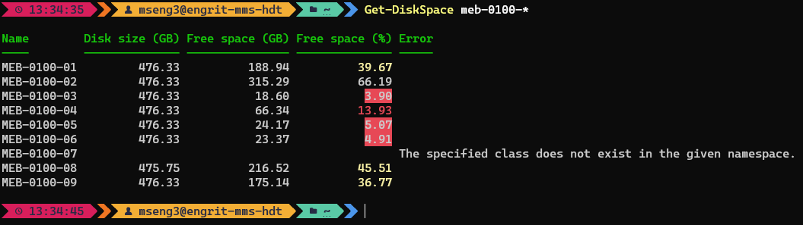

# Summary
This script reports the disk size and free space from a list of remote computers.
It calculates percent free space, and outputs the data in a convenient table to the screen, highlighting entries with low disk space. It also optionally outputs a log and a CSV file of the data.  
Intended just for a fast glance at disk space health of multiple machines. It's very fast, except when it tries to contact machines which don't respond.

For an updated version which captures more data, see: https://github.com/engrit-illinois/Get-DiskSpace.  

# Usage
1. Download `Get-DiskSpace.psm1` to the appropriate subdirectory of your PowerShell [modules directory](https://github.com/engrit-illinois/how-to-install-a-custom-powershell-module).
2. Run it using the examples and parameter documentation below.

# Examples
- `Get-DiskSpace "espl-114-01"`
- `Get-DiskSpace "espl-114-01","espl-114-02","tb-207-01"`
- `Get-DiskSpace "espl-114-*"`
- `Get-DiskSpace "espl-114-*","tb-207-01","tb-306-*"`

# Example output:
```powershell
C:\>Get-DiskSpace "espl-114-*"

Name        Disk size (GB) Free space (GB) Free space (%) Error
----        -------------- --------------- -------------- -----
ESPL-114-01            931            27.1              3
ESPL-114-02            931          480.07             52
ESPL-114-03            931          574.95             62
ESPL-114-04         931.51          430.59             46
ESPL-114-05            931          603.33             65
ESPL-114-06            931          408.35             44
ESPL-114-07            931          535.12             57
ESPL-114-08                                                WinRM cannot complete the operation. Verify that the specified computer name is valid, that the computer is accessible over the network...
ESPL-114-09            931          455.22             49

C:\>
```



# Parameters

### -ComputerName [string[]]
Required string array.  
The list of computer names and/or computer name query strings to poll for disk space data.  
Use an asterisk (`*`) as a wildcard.  
The parameter name may be omitted if the value is given as the first or only parameter.  

### -SearchBase [string]
Optional string.  
The OU distinguished name of the OU to limit the computername search to.  

### -Disk [string]
Optional string.  
The local disk about which to gather data.  
Default is `"C:"`.  

### -Parallel
Optional switch.  
If specified, gathers data from computers in parallel instead of sequentially.  
Can significantly speed up the results when polling large numbers of computers when some computers do not respond.  
Only supported in PowerShell 7+.  

### -ThrottleLimit [int]
Optional integer.  
The maximum number of computers poll in parallel simultaneously.  
Default is `50`.  

### -PercentGood [int]
Optional integer.  
The `Free space (%)` value printed in the console output for computers with a value > `-PercentGood` will be uncolored.  
Default is `50`.  

### -PercentLow [int]
Optional integer.  
The `Free space (%)` value printed in the console output for computers with a value <= `-PercentGood` and > `-PercentLow` will be colored with a yellow foreground.  
Default is `25`.  

### -PercentCritical [int]
Optional integer.  
The `Free space (%)` value printed in the console output for computers with a value <= `-PercentLow` and > `-PercentCritical` will be colored with a red foreground.  
The `Free space (%)` value printed in the console output for computers with a value <= `-PercentCritical` will be colored with a red background.  
Default is `10`.  

### -Loud
Optional switch.  
When specified, logging is output to the console.  
Otherwise the module is silent until the results are returned.  

### -MakeLog
Optional switch.  
Whether or not to log output to a log file.  
Log filename will be `Get-DiskSpace_yyyy-MM-dd_HH-mm-ss.log`.  
Log will be created in the directory specified by the `-LogDir` parameter.  

### -MakeCsv
Optional switch.  
Whether or not to log retrieved data to a CSV file.  
CSV filename will be `Get-DiskSpace_yyyy-MM-dd_HH-mm-ss.csv`.  
CSV will be created in the directory specified by the `-LogDir` parameter.  

### -LogDir [string]
Optional string.  
The directory in which to create log and/or CSV files, if any are created.  
Default is `"c:\engrit\logs"`.  

### -PassThru
Optional switch.  
If specified, the results are returned as an unformatted PowerShell object.  
When not specified, the results are returned as a formatted table, with colorized values (see example screenshot above).  

# Notes
- If run in a host that supports color coding (i.e. the default Powershell console), the values in the `Free space (%)` column will be colored according to the "Percent" parameters above. This is useful for quick scanning of results from many computers.
- By mseng3. See my other projects here: https://github.com/mmseng/code-compendium.
